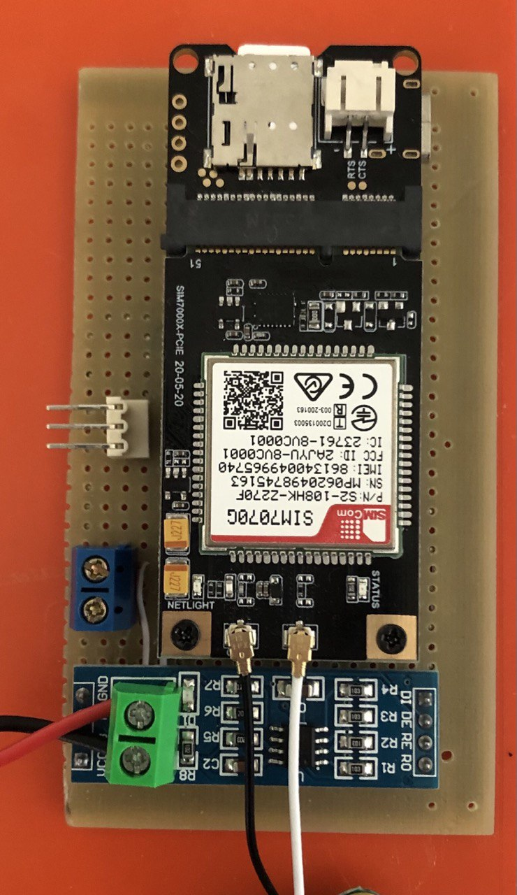

# Protótipo

## Funcionamento

Os nossos hardwares realizam a leitura do fluxo de água utilizando o sensor de [YF-S201]. 
Através do fluxo de água, calculamos quantos litros passaram pelo sensor.

### CONTROLADOR e PERIFÉRICO

O dispositivo **CONTROLADOR** é o dispositivo que possui o módulo **GPRS** [SIM7070G]. Este módulo é responsável por enviar os dados para o usuário via SMS.

O **CONTROLADOR** é responsável por requisitar as leituras realizadas por todos os dispositivos **PERIFÉRICOS** na sua rede **RS485**.

O **CONTROLADOR** também realiza a leitura de passagem de água.

Já o dispositivo **PERIFÉRICO** é responsável apenas por realizar a leitura de passagem de água.

|  |  |
|:------------------------------------------------------------:|:------------------------------------------------------------:|
| **Controlador** | **Periférico** |

### Envio das leituras

Após um período de tempo (configurável) o dispositivo **CONTROLADOR** deverá enviar uma requisição aos dispositivos **PERIFÉRICOS** através da interface **RS485** para que os mesmos retornem os valores do volume de água lidos.

### Interface WEB

Sempre que o dispositivo for ligado, uma rede Wifi será acionada com o nome `shd-{controlador/periferico}` e a senha será `hidrometro`.

Após estabelecer conexão com a rede, é possível acessar a página de configurações do dispositivo através do IP `http://192.168.4.1`.

|  |
|:----------------------------------------------:|
| *Página principal da aplicação web* |

A página apresentada possui informações das configurações disponíveis e que podem ser realizadas na aba `Configurações`.

|  |
|:----------------------------------------------:|
| *Página de configurações da aplicação web* |

Na aba `Leituras` o usuário poderá acompanhar a leitura do sensor (litros de água) em tempo real.

|  |
|:----------------------------------------------:|
| *Página de leitura da aplicação web* |

[platformio]: https://docs.platformio.org/en/latest/core/installation.html
[pandoc]: https://pandoc.org/
[ssg5-pandoc]: https://gitlab.com/Calebe94/ssg5-pandoc
[SIM7070G]: https://www.simcom.com/product/SIM7070G.html
[YF-S201]: https://cdn-shop.adafruit.com/product-files/828/C898+datasheet.pdf

